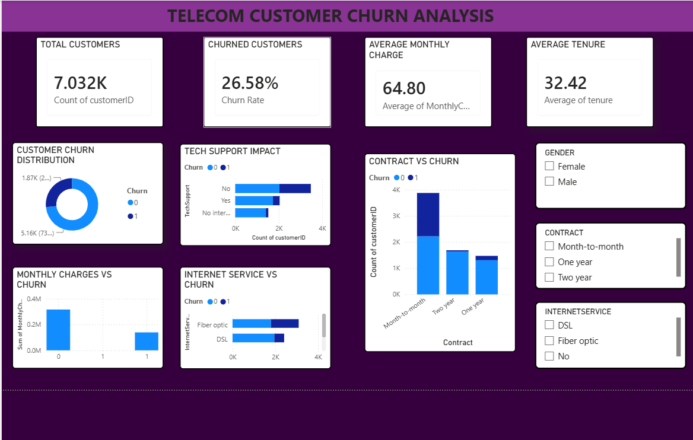

# 📊 Telco Customer Churn Analysis

## Project Overview

This project analyzes customer churn behavior in a telecommunications company using Python and Power BI.

The objective is to identify factors influencing customer churn and provide insights that help improve customer retention strategies.

---

## 🛠️ Tools & Technologies

- Python
- Pandas
- Jupyter Notebook
- Power BI

---

## 🔄 Project Workflow

Dataset → Python → Power BI Dashboard

### Python
- Data Loading
- Data Cleaning
- Data Transformation
- Exploratory Data Analysis (EDA)
- Feature Engineering

### Power BI
- KPI Development
- Interactive Dashboard Creation
- Business Insight Visualization

---

## 📂 Dataset Information

The Telco Customer Churn Dataset contains customer demographic details, account information, subscribed services, billing information, and churn status.

### Customer Demographics
- Customer ID
- Gender
- Senior Citizen
- Partner
- Dependents

### Account Information
- Tenure
- Contract Type
- Payment Method
- Paperless Billing

### Services
- Phone Service
- Multiple Lines
- Internet Service
- Online Security
- Online Backup
- Device Protection
- Tech Support
- Streaming TV
- Streaming Movies

### Charges
- Monthly Charges
- Total Charges

### Target Variable
- Churn

---

## 📊 Dashboard Features

### KPI Cards
- Customers
- Churned
- Churn %
- Avg Charges
- Avg Tenure

### Visualizations
- Churn Distribution
- Contract vs Churn
- Tech Support vs Churn
- Internet Service Analysis
- Monthly Charges Analysis
- Gender-wise Analysis

### Filters
- Gender
- Contract Type
- Internet Service

---

## 🔍 Key Insights

- Customers with Month-to-Month contracts show the highest churn.
- Customers without Tech Support are more likely to churn.
- Higher Monthly Charges are associated with increased churn.
- New customers are more likely to leave than long-term customers.
- Fiber Optic users exhibit higher churn rates compared to other internet service users.

---

## 📈 Dashboard Preview

---

## 🚀 Business Impact

This dashboard helps organizations:

- Identify churn-prone customers
- Understand major churn drivers
- Improve customer retention strategies
- Support data-driven decision making

---

## 👩‍💻 Author

Monisha Shiva Kumar
